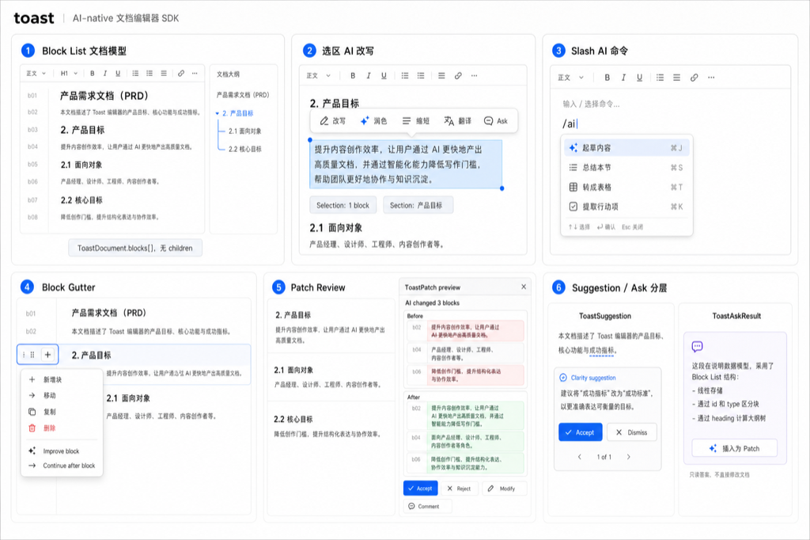

# Toast AI Native Editor Design

## 1. Design Goal

`toast` 是简洁、现代、AI Inside 的 Editor SDK / Editor Component。它提供类似 Markdown 的数据编辑体验，但公开数据模型固定是 linear block list，不是 HTML DOM tree，也不是 Notion / BlockNote 风格的 physical block tree。

核心目标：

- 简洁：首屏是编辑器，默认 UI 克制，操作按需出现。
- 现代：block gutter、selection bubble、slash command、side panel、revision card 都是默认组件。
- AI Inside：AI 嵌入 cursor、selection、block、section、document 操作，不只是外置 chat。
- 数据优先：输出稳定 `ToastDocument.blocks[]`，适合存储、同步、AI patch 和 Markdown 互转。

## 2. Visual Reference



效果图展示 6 个关键操作：

1. linear block list 与 heading 逻辑目录。
2. selection bubble 中的 AI 改写入口。
3. `/ai` slash command。
4. block gutter 和块级 AI 操作。
5. `ToastPatch` revision-card review。
6. `ToastSuggestion` 与 `ToastAskResult` 分层。

## 3. Core Product Definition

```text
ToastDocument = ToastBlock[]
Heading = logical hierarchy computed from block list
AI edit = ToastPatch
AI answer = ToastAskResult
AI writing hint = ToastSuggestion
Runtime = Tiptap / ProseMirror
UI = React-only in Phase 1
Public model != ProseMirror JSON
Patch = JSON Patch + Toast metadata
```

`toast` 的创新点不在重新实现富文本底座，而在把编辑器控制面变成 AI-native protocol：AI 能理解选区、文档结构、上下文、操作历史，并以可审阅 patch 修改内容。

## 4. Public Data Model

公开文档模型必须是 list：

```ts
interface ToastDocument {
  version: string;
  blocks: ToastBlock[];
  metadata?: Record<string, unknown>;
}

interface ToastBlock {
  id: string;
  type: ToastBlockType;
  attrs?: Record<string, unknown>;
  content?: ToastInlineContent[] | ToastTableContent | ToastMediaContent;
}
```

禁止：

```ts
interface ToastBlock {
  children?: ToastBlock[];
}
```

Heading 不产生物理子节点。以下文档：

```text
H1
Content
H2
Content
H3
Content
H2
Content
```

存储仍然是：

```ts
[
  { id: "b01", type: "heading", attrs: { level: 1 } },
  { id: "b02", type: "paragraph" },
  { id: "b03", type: "heading", attrs: { level: 2 } },
  { id: "b04", type: "paragraph" },
  { id: "b05", type: "heading", attrs: { level: 3 } },
  { id: "b06", type: "paragraph" },
  { id: "b07", type: "heading", attrs: { level: 2 } },
  { id: "b08", type: "paragraph" }
]
```

目录、折叠、section range、AI context 都通过扫描 `blocks[]` 得到。

## 5. Block Baseline

首期 block 类型保持克制：

```ts
type ToastBlockType =
  | "paragraph"
  | "heading"
  | "listItem"
  | "quote"
  | "code"
  | "table"
  | "image"
  | "divider"
  | "callout";
```

`listItem` 也不使用 `children`，用 attrs 表达层级：

```ts
{
  id: "b12",
  type: "listItem",
  attrs: {
    kind: "bullet",
    indent: 2,
    checked: false
  }
}
```

## 6. Runtime Architecture

Tiptap / ProseMirror 只作为 runtime adapter：

```text
ToastDocument
  <-> Toast Tiptap Adapter
    <-> ProseMirror Doc
      <-> DOM / Editor View
```

公开 SDK 主控制面是 `ToastEditor`，不是 Tiptap `Editor`。

包边界：

| Package | Responsibility |
| --- | --- |
| `@toast-editor/core` | block model、selection、command、context、patch、history |
| `@toast-editor/tiptap` | Tiptap adapter、schema、extension、transaction apply |
| `@toast-editor/react` | Phase 1 React Editor Component and UI components |
| `@toast-editor/ai` | AI action、provider adapter、streaming、tool permissions |
| `@toast-editor/extensions` | built-in blocks, marks and commands |

首期只支持 React UI。Vue、Svelte、Web Component 或其它 UI adapter 不进入 Phase 1。

## 7. SDK Interface

```ts
interface ToastEditor {
  getDocument(): ToastDocument;
  setDocument(document: ToastDocument): void;

  getSelection(): ToastSelection;
  getContext(options: ToastContextOptions): ToastContext;

  runCommand(command: ToastCommand): void;

  ask(input: ToastAIInput): Promise<ToastAskResult>;
  suggest(input: ToastSuggestionInput): Promise<ToastSuggestion[]>;
  proposePatch(input: ToastAIInput): Promise<ToastPatch>;

  applyPatch(patchId: string): void;
  rejectPatch(patchId: string): void;
  rollbackPatch(patchId: string): void;

  createCheckpoint(input: ToastCheckpointInput): ToastCheckpoint;
  restoreCheckpoint(checkpointId: string): void;
}
```

## 8. Selection And Section Model

AI 不能只知道 DOM selection 或 ProseMirror position。

```ts
interface ToastSelection {
  kind: "cursor" | "inline" | "block" | "blockRange";
  anchorBlockId: string;
  focusBlockId: string;
  inlineRange?: {
    from: number;
    to: number;
  };
  selectedText?: string;
  selectedBlocks?: ToastBlock[];
  section?: ToastSectionRange;
}

interface ToastSectionRange {
  headingBlockId: string;
  level: number;
  fromBlockId: string;
  toBlockId: string;
  title: string;
}
```

Section 由 heading 与 block range 计算，不存储为 tree。

## 9. AI Output Layers

AI 输出分三类：

| Layer | Object | Review | Use Case |
| --- | --- | --- | --- |
| Ask | `ToastAskResult` | read-only / insert explicitly | summary, Q&A, quick question |
| Suggest | `ToastSuggestion` | accept / dismiss | grammar, clarity, tone, short rewrite |
| Patch | `ToastPatch` | preview / accept / reject / rollback | rewrite, insert, transform, agent edit |

`ToastAskResult` 不修改文档：

```ts
interface ToastAskResult {
  id: string;
  scope: ToastScope;
  answer: string;
  context: ToastContextSummary;
  actions?: ToastAskAction[];
}
```

`ToastSuggestion` 是轻量写作建议：

```ts
interface ToastSuggestion {
  id: string;
  range: ToastInlineRange | ToastBlockRange;
  kind: "grammar" | "clarity" | "tone" | "rewrite";
  replacement: ToastInlineContent[] | ToastBlock[];
  explanation?: string;
  state: "pending" | "accepted" | "dismissed";
}
```

`ToastPatch` 承载真实文档变更：

```ts
interface ToastPatch {
  id: string;
  actionId: string;
  scope: ToastScope;
  before: ToastPatchSnapshot;
  after: ToastPatchSnapshot;
  operations: ToastPatchOperation[];
  context: ToastContextSummary;
  state: "preview" | "accepted" | "rejected" | "rolledBack";
}
```

`ToastPatch.operations` 使用 JSON Patch。它兼容 RFC 6902 的操作名，但 path 只能指向 Toast 受控路径：

```ts
interface ToastPatchOperation {
  op: "add" | "remove" | "replace" | "move" | "copy" | "test";
  path: ToastPatchPath;
  from?: ToastPatchPath;
  value?: unknown;
}

type ToastPatchPath =
  | `/blocks/${number}`
  | `/blocks/${number}/attrs`
  | `/blocks/${number}/attrs/${string}`
  | `/blocks/${number}/content`
  | `/blocks/${number}/content/${number}`
  | `/blocks/${number}/content/rows/${number}`
  | `/blocks/${number}/content/rows/${number}/cells/${number}`
  | `/blocks/${number}/content/rows/${number}/cells/${number}/content`;
```

选择 JSON Patch 的原因：

- 格式通用，适合存储、传输、审计和回放。
- AI 和宿主系统容易生成和理解。
- 可以通过 path 白名单保持 block-list 数据安全。
- ProseMirror step 可作为 runtime apply backend，但不成为公开协议。

## 10. AI Operation Flows

文档修改：

```text
Trigger
-> Select Scope
-> Build Context
-> Run AI Action
-> Generate ToastPatch
-> Preview
-> Accept / Reject / Rollback
-> Record Operation
```

只读问答：

```text
Trigger
-> Build Context
-> Return ToastAskResult
-> Optional Insert As Patch
```

轻量建议：

```text
Detect
-> Show ToastSuggestion
-> Accept / Dismiss
-> Record Suggestion State
```

## 11. Context Model

```ts
interface ToastContext {
  scope: ToastScope;
  selection?: ToastSelection;
  blocks: ToastBlock[];
  section?: ToastSectionRange;
  surroundingBlocks?: ToastBlock[];
  documentSummary?: string;
  rules?: ToastRule[];
  history?: ToastOperationSummary[];
  sources?: ToastContextSource[];
  coverage: ToastContextCoverage;
}
```

UI 必须显示 context chips：

```text
[Selection: 3 blocks]
[Section: 产品目标]
[Rule: Use concise Chinese]
[History: Last AI patch rejected]
[Source: Research summary]
```

长文档 summary / Q&A 必须显示 coverage：全文、当前 section、选区、还是 chunk summary。

## 12. UI Surface

整体风格：简洁、现代、文档优先、AI 低干扰。

默认主题重新设计为 neutral editor theme，不继承第一代微信样式。主题从第一天支持 light / dark：

| Token | Light | Dark |
| --- | --- | --- |
| `--toast-bg` | `#ffffff` | `#101114` |
| `--toast-surface` | `#f7f8fa` | `#17191d` |
| `--toast-border` | `#e5e7eb` | `#2a2d33` |
| `--toast-text` | `#1f2328` | `#f2f4f7` |
| `--toast-muted` | `#6b7280` | `#9aa3af` |
| `--toast-accent` | `#2563eb` | `#60a5fa` |
| `--toast-success` | `#16a34a` | `#4ade80` |
| `--toast-danger` | `#dc2626` | `#f87171` |

主题要求：

- 所有组件只读 CSS variables，不写死颜色。
- Light / dark 可由 `data-theme="light|dark"` 或宿主 theme provider 控制。
- Patch diff 的 added / removed 色彩必须满足深浅色可读性。
- AI 元素使用 accent，不使用大面积渐变或装饰色块。

布局：

```text
┌──────────────────────────────────────────────┐
│ Toolbar                                      │
├──────────────┬──────────────────────┬────────┤
│ Outline      │ Editor Canvas         │ AI     │
│ optional     │                      │ Panel  │
└──────────────┴──────────────────────┴────────┘
```

默认 UI：

- 文档画布一直可见。
- toolbar 常驻但克制。
- block gutter 只在 hover / focus 时出现。
- selection bubble 只在选中内容时出现。
- AI side panel 只在 ask / patch / agent session 中展开。

组件：

| Component | Responsibility |
| --- | --- |
| `ToastToolbar` | formatting, block type, insert, common AI actions |
| `ToastSelectionBubble` | inline formatting, Ask, Rewrite, Polish |
| `ToastSlashCommand` | insert block, transform block, AI command |
| `ToastBlockSideMenu` | add, move, duplicate, delete, block AI |
| `ToastDragHandle` | move block within linear list |
| `ToastAiPanel` | document Q&A, context chips, patch list |
| `ToastSuggestionCard` | local suggestion accept / dismiss |
| `ToastRevisionCard` | patch accept / reject / comment / modify / withdraw |
| `ToastPatchPreview` | block-level diff and rollback |

## 13. Markdown-Like Editing

用户感知接近 Markdown：

````text
# Heading 1
## Heading 2
- list item
> quote
```code
````

内部仍然是 `ToastDocument.blocks[]`，不是 Markdown string。

支持 shortcuts：

| Shortcut | Result |
| --- | --- |
| `# ` | heading level 1 |
| `## ` | heading level 2 |
| `- ` | bullet list item |
| `1. ` | ordered list item |
| `> ` | quote |
| triple backtick | code block |

支持 adapter：

```text
ToastDocument <-> Markdown
ToastDocument <-> HTML
ToastDocument <-> ProseMirror JSON
```

主协议始终是 `ToastDocument`。

## 14. AI Entry Points

首期必须支持：

- empty block: Help me write
- selection: Rewrite / Polish / Translate / Summarize / Ask
- slash: `/ai`
- block gutter: Improve block / Continue after block
- side panel: Ask document / Summarize / Review
- suggestion card: Accept / Dismiss
- patch panel: Accept / Reject / Rollback

图片和表格的专项插入/编辑设计见 `docs/30-designs/IMAGE-TABLE-INSERT-DESIGN.md`。

首期 AI actions：

- Ask about selection
- Ask about document
- Draft here
- Rewrite selection
- Polish selection
- Shorten selection
- Expand selection
- Translate selection
- Summarize selection
- Summarize section
- Summarize document
- Improve block
- Convert selection to list
- Convert selection to table
- Extract action items

暂缓：

- database autofill
- scheduled automation
- cross-document agent edit
- persistent AI prompt block
- full workflow automation

## 15. Review And Checkpoint

Patch review 采用 revision-card mental model。

```text
AI changed 3 blocks

Before
...

After
...

Accept | Reject | Modify | Comment
```

Agent / document-level action 前创建 checkpoint：

```text
Before AI operation
-> checkpoint
-> patch list
-> accept / reject
-> rollback if needed
```

Checkpoint 只负责 AI operation rollback，不替代完整版本管理。

## 16. Phase Plan

Phase 1:

- Tiptap runtime adapter
- React-only Editor Component
- linear `ToastDocument.blocks`
- `ToastSelection`
- `ToastCommand` registry
- JSON Patch based `ToastPatch`
- neutral light / dark theme
- toolbar / bubble / slash / block gutter / drag handle
- AI side panel
- `ToastAskResult`
- `ToastSuggestion`
- `ToastPatch`
- patch preview and revision card
- context chips
- checkpoint

Phase 2:

- source provider
- workspace search
- meeting transcript source
- ghost text
- partial accept
- document translation clone
- collaboration notification
- non-React UI adapters

Defer:

- database autofill
- scheduled automation
- cross-document agent
- workflow automation

## 17. Design Summary

```text
Tiptap gives runtime.
BlockNote gives productized block UI lessons.
Cursor gives AI operation model.
Word / Feishu give review model.
Google / Notion give source/context lessons.
Grammarly gives low-disruption suggestion model.

toast combines them into:
linear block list + explicit context + patch-first AI editing.
```

一句话定义：

`toast` 是一个基于 Tiptap runtime、以 linear block list 为公开数据模型、以 `ToastPatch` / `ToastSuggestion` / `ToastAskResult` 为 AI 控制协议的现代 AI-native editor SDK。

## 18. Open Items

- `ToastDocument` 与 Markdown / HTML / ProseMirror JSON 的 adapter 边界。
- 首期 `ToastSuggestion` 是否只做本地文本建议，还是接入远程 AI。
